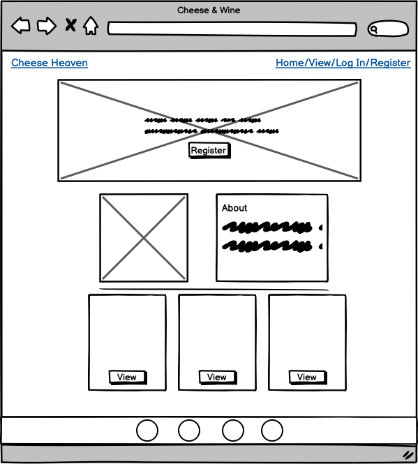
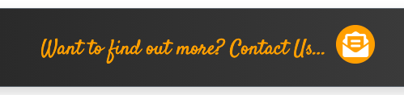
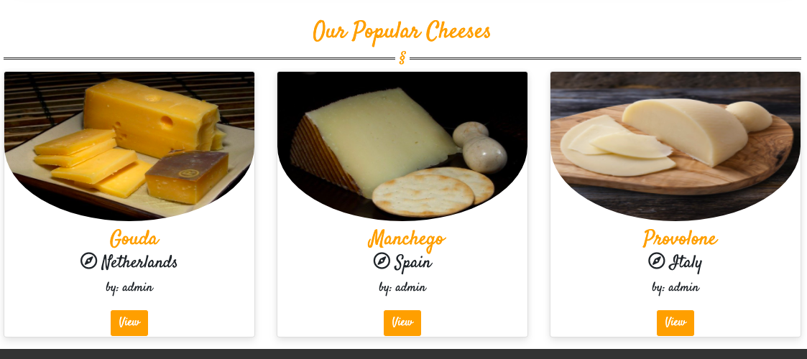

# Data Centric Development Project - Code Institute

# Cheese & Wine

Cheese & Wine is a helpful guide to show you pairings on which cheese and wines pair well together, you can create amazing wine and cheese pairings on your own, and share them with others! So that the next time you’re on a wine and cheese mission, you’ll have no doubt what to choose!

The live website can be found [here]()

## Table of Contents

* [Project Summary](#Project-Summary)
* [User Experience Design (UX)](#User-Experience-Design)
  * [The Strategy Plane](#The-strategy-Plane)
    * [User stories](#User-Stories) 
  * [The Scope Plane](#The-Scope-Plane)
  * [The Structure Plane](#The-Structure-Plane)
  * [The Skeleton Plane](#The-Skeleton-Plane)
    * [Wireframes](#Wireframes)
    * [Database Design](#Database-Design)
    * [Security](#Security)
  * [The Surface Plane](#The-Surface-Plane)
* [Features](#Features)
   * [Existing Features](#Existing-Features)
   * [Future Features](#Features-Left-to-Implement)
* [Technologies](#Technologies)
* [Testing](#Testing)
* [Deployment](#Deployment)
* [Credits](#Credits)

****

# Project Summary

Welcome to my Data Centric Milestone Project for Code Institute. 

The Goal of my project is to build a guide for cheese and wine lovers, who aren't sure where to start with choosing a wine for a cheese or vice versa. I wanted the site to be easy to navigate through, by having both the cheese and wine pairing on the same page.  

Any guest of the site can view the pairings, only a registered user can upload,edit and delete there own pairings.

# User Experience Design

## The Strategy Plane

## User stories 

### Guest User

* As a guest user, I want to browse and understand the concept of the website easily.

* As a guest user, I want to be able to access this website from different devices easily.

* As a guest user, I want to easily navigate the site so that I can find content quickly with ease.

* As a guest user, I want to be able to contact the site owner with any further questions I may have.

* As a guest user, I want to easily register to the site, so that I can add my own pairings.

* As a guest user, I want to be able to search through the cheeses to check if they have one I am interested in.

### Registered User

* As a registered user, I want to be able to log in with my username and password.

* As a registered user, I want to be able to create and add cheese and wine pairings to the website.

* As a registered user, I want the ability to edit my pairings on the website.

* As a registered user, I want the ability to delete my pairing if I want to.

* As a registered user, I want to be able to delete my profile.

* As a registered user, I want the ability to see all the published pairings on the site.

### Admin

* As an admin, I want the ability to edit or delete all users pairings on the website and delete if necessary.

## The Scope Plane 

### Features planned:

* Responsive design.
* Navigation Menu, clear to navigate through.
* Search bar.
* Website title and about section with more information.
* MongoDB databases to store pairings and user login/profile information.
* Seperate cards for each individual pairing.
* Login functionality.
* Logout functionality.
* Profile Page
* User's ability to submit there own pairings.

*  In designing this site, I wanted the user to have a positive experience and for the web-site to be simple to use. User can easily navigate through website to view each pairing, and use the search function to find a cheese by country.

## The Structure Plane

When the user arrives on site, it will see main hero image, text and immidiate button to register to the site. Navigation is always on top of the screen and the main cheese and wine logo acts as a link to Home page. Below the main hero image I have used a carousel for a diverse range of pictures, with a about section, to explain to the user exactly what the site entails.  

If user wants to contact the site owners directly, there is a email contact form set up. The user will then recieve confirmation if the email has been sent or if there is a error. The most popular cheeses are located directly underneth, with a limit of 3 as to not overcrowd the page. If the user clicks on the "View Cheeses" option they will then be re-located to all of the cheeses, showing where they are from and who uploaded to the site. 

Once the user has registered an account, they then have the ability to upload there own pairings to the site, while also being able to edit and delete them at any time. They can also browse through other cheeses if they are trying to find one from a specific country for a match. If there is no cheese from that country, they will be promted to try another. They also have the ability to delete there profile at any time.  

Footer is visible on any page and icons themselves are clickable and lead to social links.

## The Skeleton Plane 

### Wireframes
Home:  

### Database Design

MongoDB Object format examples:

Collection: users
 {

    _id: unique-value,
    username: "admin"
    password : "12a6y98767dn",
    user_loc: "ireland"
}

Collection: cheeses
 {

    _id: unique-value,
    cheese_name: "brie"
    country_of_origin: "France"
    type: "Soft, Artisan, Soft-ripened"
    flavour: "fruity, mild, nutty, tangy"
    texture: "Buttery, runny and soft-ripened"
    description: "Brie is the best known..."
    cheese_image: "https://i.imgur.com/MD23KTQ.jpg"
    wine_id: "Malbec"
    origin: "Cahors, France."
    regions: "Argentina, Chile, Tuscany"
    sweetness: "Dry"
    colour: "Deep Purple"
    wine_description: "Originating in Cahors ..."
    wine_image: "https://i.imgur.com/NvHZLGy.jpg"
    created_by: "session[user]"
}

### Security

Database connection details are set up in an [env.py](#https://pypi.org/project/env.py/) for development, for security reasons this is not uploaded to GitHub so that database and connection details are not visible to users. In production these are stored in Heroku.

## The Surface Plane 

## Design Choices

### Fonts

* The font used for titles, logo and throughout the majority of the site is 'Satisfy' by [Goggle Fonts](#https://fonts.google.com/). I used this to create a playful and sophisticated look. In other areas for better readability I used 'Lato', as I feel they compliment each other well.

### Icons and Images

* All icons used on this website are taken from [Font Awesome](#https://fontawesome.com/)
* The Favicon used for this website is from [Favicon.io.](#https://favicon.io/)
* All Images used throughout the website are from [Pixabay](#https://pixabay.com/)
* I used the image hosting site [Imgur](#https://imgur.com/) to store my images.

### Frameworks

* Bootstrap 4 to build the front-end. I really liked the layout of the [Small Business Template](#https://startbootstrap.com/template/small-business) on Bootstrap and used this for my inspiration of my index page.
* Micro framework [Flask](#https://flask.palletsprojects.com/en/1.1.x/), to build the backend.

### Colours

I wanted to use a fairly neutral colour scheme by sticking to black, grey, white and with a hint of colour by adding a orange colour to make certain elements and text stand out. I wanted to create a envoiment where a user can see what it wants straight away. 

* Colours used throughout the web-site: 
  * Navigation bar/footer: - 
  * Pop of orange: - 
  * Container colour: -  

 # Features

 ## Existing Features

* Navigation bar
  * Navigation bar is visible on all pages and on all sizes, and completely responsive. The Navigation Bar displays the logo of the website and the options "Home", "View Cheeses", "Log In" and "Register" when the user is not logged in.

* Welcome section & carousel
  * This feature is a pretty straight forward, It explaines the guide and has a button option to view the pairings.
  * I added a Bootstrap carousel that display images on demand or automatically for a visually more engaging user experience.

* Contact Us  

  * Contact modal form with EmailJS functionality to contact site owner. Button turns green and reads "E-mail submitted! Closing..." or if failure to send gives a 404 message of "Failed to submit. Refresh page"

* Popular Cheeses  

  * This feature is to showcase some of the most popular cheeses on the website. Pairings created in the database by the admin only. (3 only as I didnt want to over crowd the page).
  * The cheeses are displayed on responsive cards with a hover effect (not available on mobile). The effect is taken from [ordinarycoders](#https://www.ordinarycoders.com/blog/article/codepen-bootstrap-card-hovers#:~:text=Hover%20Bootstrap%20Cards&text=A%20box%2Dshadow%20is%20declared,user%20hovers%20over%20the%20card.&text=To%20recreate%20the%20hover%2C%20just,CSS%20declarations%20to%20your%20project.).

 

