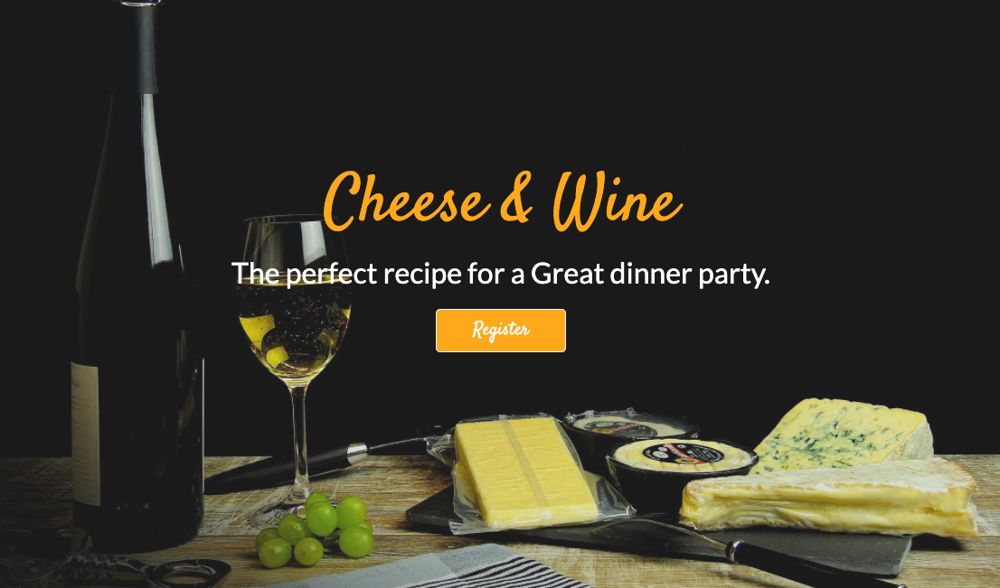

# Data Centric Development Project - Code Institute

# Cheese & Wine

Cheese & Wine is a helpful guide to show you pairings on which cheese and wines pair well together, you can create amazing wine and cheese pairings on your own, and share them with others! So that the next time you’re on a wine and cheese mission, you’ll have no doubt what to choose!

The live website can be found [here]()

## Table of Contents

* [Project Summary](#Project-Summary)
* [User Experience Design (UX)](#User-Experience-Design)
  * [User stories](#User-Stories) 
  * [Five Planes](#Fives-Planes)
* [Wireframes](#Wireframes)
* [Features](#Features)
   * [Existing Features](#Existing-Features)
   * [Future Features](#Features-Left-to-Implement)
* [Technologies](#Technologies)
* [Testing](#Testing)
* [Deployment](#Deployment)
* [Credits](#Credits)

****

# Project Summary

Welcome to my Data Centric Milestone Project for Code Institute. 

The Goal of my project is to build a guide for cheese and wine lovers, who aren't sure where to start with choosing a wine for a cheese or vice versa. I wanted the site to be easy to navigate through, by having both the cheese and wine pairing on the same page.  

Any guest of the site can view the pairings, only a registered user can upload,edit and delete there own pairings.

# User Experience Design

## User stories

### Guest User

* As a guest user, I want to browse and understand the concept of the website easily.

* As a guest user, I want to be able to access this website from different devices easily.

* As a guest user, I want to easily navigate the site so that I can find content quickly with ease.

* As a guest user, I want to be able to contact the site owner with any further questions I may have in regards to the website.

* As a guest user, I want to easily register to the site, so that I can add my own pairings.

* As a guest user, I want to be able to search through the cheeses to check if they have one I am interested in.

### Registered User

* As a registered user, I want to be able to log in with my username and password.

* As a registered user, I want to be able to create and add cheese and wine pairings to the website.

* As a registered user, I want the ability to edit my pairings on the website.

* As a registered user, I want the ability to delete my pairing if I want to.

* As a registered user, I want to be able to delete my profile.

* As a registered user, I want the ability to see all the published pairings on the site.

