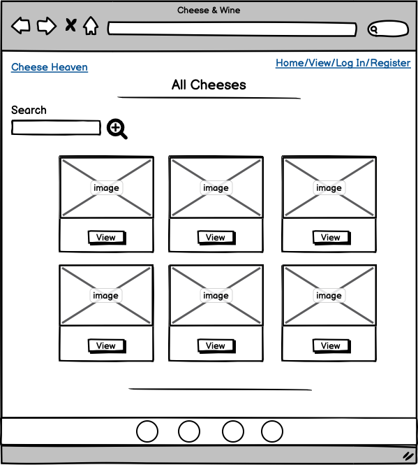
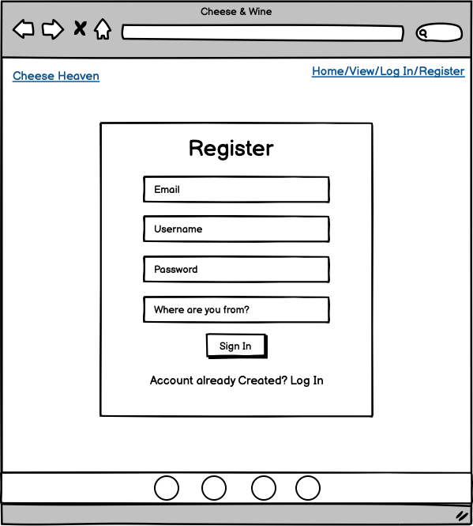
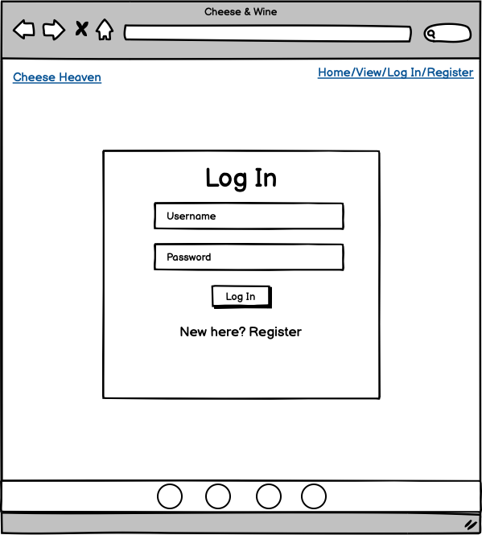
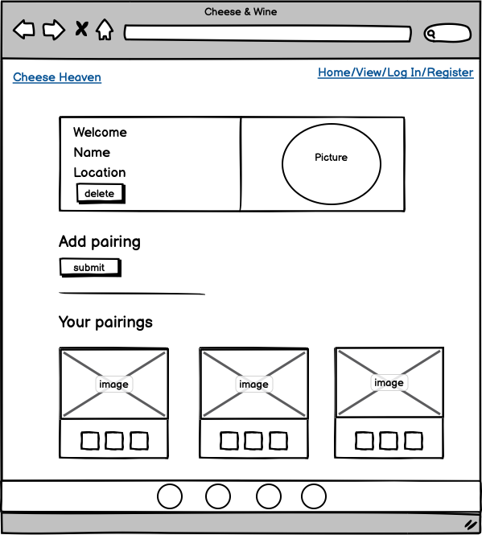
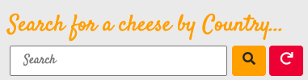
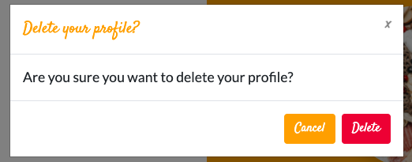

# Data Centric Development Project - Code Institute

# "Cheese & Wine"

Cheese & Wine is a helpful guide to show you pairings on which cheeses and wines pair well together, you can create amazing wine and cheese pairings on your own, and share them with others, so that the next time you’re on a wine and cheese mission, you’ll have no doubt what to choose!

The live website can be found [here](https://flask-cheese.herokuapp.com/)

## Table of Contents

* [Project Summary](#project-summary)
* [User Experience Design (UX)](#user-experience-design)
  * [The Strategy Plane](#the-strategy-plane)
    * [User stories](#user-stories) 
  * [The Scope Plane](#the-scope-plane)
  * [The Structure Plane](#the-structure-plane)
  * [The Skeleton Plane](#the-skeleton-plane)
    * [Wireframes](#wireframes)
    * [Database Design](#database-design)
    * [Security](#security)
  * [The Surface Plane](#the-surface-plane)
* [Features](#features)
   * [Existing Features](#existing-features)
   * [Future Features](#future-features)
* [Technologies](#technologies)
* [Testing](#testing)
* [Deployment](#deployment)
* [Credits](#credits)

****

# Project Summary

Welcome to my Data Centric Milestone Project for Code Institute. 

The goal of my project is to build a guide for cheese and wine lovers, who aren't sure where to start with choosing a wine for a cheese or vice versa. I wanted the site to be easy to navigate, by having both the cheese and wine pairings on the same page.  

Any guest of the site can view the pairings, only a registered user can upload,edit and delete there own pairings.

# User Experience Design

## The Strategy Plane

## User stories 

### Guest User

* As a guest user, I want to browse and understand the concept of the website easily.

* As a guest user, I want to be able to access this website from different devices easily.

* As a guest user, I want to easily navigate the site so that I can find content quickly and with ease.

* As a guest user, I want to be able to contact the site owner with any further questions I may have.

* As a guest user, I want to easily register to the site, so that I can add my own pairings.

* As a guest user, I want to be able to search through the cheeses to check if they have one I am interested in.

### Registered User

* As a registered user, I want to be able to log in with my username and password.

* As a registered user, I want to be able to create and add cheese and wine pairings to the website.

* As a registered user, I want the option to edit my pairings on the website.

* As a registered user, I want the option to delete my pairing if I wish to.

* As a registered user, I want to be able to delete my profile.

* As a registered user, I want the option to see all the published pairings on the site.

### Admin

* As an admin, I want the ability to edit or delete all user pairings on the website and delete if necessary.

## The Scope Plane 

### Features planned:

* Responsive design.
* Navigation Menu.
* Search bar.
* Carousel and About section with more information.
* MongoDB databases to store pairings and user login/profile information.
* Separate cards for each individual pairing.
* Login functionality.
* Logout functionality.
* Profile Page
* User's ability to submit their own pairings.

*  In designing this site, I wanted the user to have a positive experience and for the website to be simple to use. Users can easily navigate through the website to view each pairing, and also use the search function to find a cheese by country.

## The Structure Plane  

When the user arrives on site, he/she will see main hero image, text and immediate button to register to the site. Navigation is always on top of the screen and the main cheese and wine logo acts as a link to the home page. Below the main hero image I have used a carousel for a diverse range of pictures, with an About section, to explain to the user exactly what the site entails.  

If the user wishes to contact the site owners directly, there is an email contact form set up. The user will then receive confirmation if the email has been sent or if there is an error. The most popular cheeses are located directly underneath, with a limit of three in order to not overcrowd the page. If the user clicks on the "View Cheeses" option they will then be re-located to all of the cheeses, showing where they are from and who uploaded them to the site. 

Once the user has registered an account, they then have the ability to upload their own pairings to the site, while also being able to edit and delete them at any time. They can also browse through other cheeses if they are trying to find one from a specific country for a match. If there is no cheese from that country, they will be prompted to try another. They also have the option to delete their profile at any time.  

Footer is visible on any page and icons themselves are clickable and lead to social links.

## The Skeleton Plane 

### Wireframes
Home:  
 
View cheeses:  
 
Pairings:  
 
Register:  
 
Log In:  
 
Profile:  
 

### Database Design

MongoDB Object format examples:

Collection: users
 {

    _id: unique-value,
    username: "admin"
    password : "12a6y98767dn",
    user_loc: "ireland"
}

Collection: cheeses
 {

    _id: unique-value,
    cheese_name: "brie"
    country_of_origin: "France"
    type: "Soft, Artisan, Soft-ripened"
    flavour: "fruity, mild, nutty, tangy"
    texture: "Buttery, runny and soft-ripened"
    description: "Brie is the best known..."
    cheese_image: "https://i.imgur.com/MD23KTQ.jpg"
    wine_id: "Malbec"
    origin: "Cahors, France."
    regions: "Argentina, Chile, Tuscany"
    sweetness: "Dry"
    colour: "Deep Purple"
    wine_description: "Originating in Cahors ..."
    wine_image: "https://i.imgur.com/NvHZLGy.jpg"
    created_by: "session[user]"
}

### Security

Database connection details are set up in an [env.py](#https://pypi.org/project/env.py/) for development, for security reasons this is not uploaded to GitHub so that database and connection details are not visible to users. In production these are stored in Heroku.

## The Surface Plane 

## Design Choices

### Fonts

* The font used for titles, logo and throughout the majority of the site is 'Satisfy' by [Google Fonts](#https://fonts.google.com/). I used this to create a playful and sophisticated look. In other areas for better readability I used 'Lato', as I feel they compliment each other well.

### Icons and Images

* All icons used on this website are taken from [Font Awesome](#https://fontawesome.com/)
* The Favicon used for this website is from [Favicon.io.](#https://favicon.io/)
* All Images used throughout the website are from [Pixabay](#https://pixabay.com/)
* I used the image hosting site [Imgur](#https://imgur.com/) to store my images.

### Frameworks

* Bootstrap 4 to build the front-end. I really liked the layout of the [Small Business Template](#https://startbootstrap.com/template/small-business) on Bootstrap and used this as my inspiration for my index page.
* Micro framework [Flask](#https://flask.palletsprojects.com/en/1.1.x/), to build the backend.

### Colours

I wanted to use a fairly neutral colour scheme by sticking to black, grey and white, with a hint of colour by adding a orange to make certain elements and text stand out. I wanted to create an environment where a user is directed where it wants straight away.

* Colours used throughout the web-site: 
  * Navigation bar/footer: - 
  * Pop of orange: - 
  * Container colour: -  

 # Features

 ## Existing Features

* Navigation Bar
  * Navigation bar is visible on all pages and on all sizes, and completely responsive. The Navigation Bar displays the logo of the website and the options "Home", "View Cheeses", "Log In" and "Register" when the user is not logged in.

* Welcome Section & Carousel
  * This feature is pretty straightforward. It explains the guide and has a button option to view the pairings.
  * I added a Bootstrap carousel that display images on demand or automatically for a visually more engaging user experience.

* Contact Us  

  * Contact modal form with EmailJS functionality to contact site owner. Button turns green and reads "E-mail submitted! Closing..." or if failure to send gives a 404 message of "Failed to submit. Refresh page"

* Popular Cheeses  

  * This feature is to showcase some of the most popular cheeses on the website. Pairings created in the database by the admin only. (3 only as I didnt want to overcrowd the page).
  * The cheeses are displayed on responsive cards with a hover effect (not available on mobile). The effect is taken from [ordinarycoders](#https://www.ordinarycoders.com/blog/article/codepen-bootstrap-card-hovers#:~:text=Hover%20Bootstrap%20Cards&text=A%20box%2Dshadow%20is%20declared,user%20hovers%20over%20the%20card.&text=To%20recreate%20the%20hover%2C%20just,CSS%20declarations%20to%20your%20project.).

* Search box  

  * This feature allows the user to search for a cheese based on its origin in the cheeses.html.
  * When no results match the search, the text "No Result Found" is displayed.

* Individual Pairing Page
   * This page allows the user to view a custom pairing page:
   * Cheese title
   * Country of origin
   * Type of cheese
   * Flavour of Cheese
   * Texture
   * Description
   * Cheese image
   * Wine title
   * Wine regions
   * Origin of Wine
   * Sweetness level
   * Wine Colour
   * Description
   * Wine Image

* Register 

  The registration form takes the following information of the user to create an account:
  * Email address
  * Username
  * Password
  * Location

  The passwords are hashed and protected using the import "generate_password_hash, check_password_hash" from werkzeug security.

* Log In

  * When a user is already registered, they may use the log in form to access their account. The user needs their password and username to log in.

* Profile

  * Once a user has registered they will be directed to their profile page, which showcases their information.
  * The section "Your Pairings" displays the pairings submitted by the user. The user can also create a pairing by clicking on a specified button above the cheese cards.
  * Each cheese card has 3 buttons : View, Edit, Delete.

* Delete Profile  

  * The user can delete their profile by clicking on the red "Delete" button in the dedicated profile card.
  * This feature allows the user to permanently delete their profile.
  * When the button is clicked a modal will ask for confirmation to avoid any mistakes.
  * If the confirmation button is clicked, the profile is permanently deleted and the now guest user will be redirected to the registration page with an a flash message above.

* Add Pairing

  * This feature allows the user to submit a custom pairing through a form which includes descriptions of the cheeses and wines.
  * After clicking on the submit button, the user can see the new pairing on the view cheeses page topped with a validation flash message. The pairing will then appear in the user's profile.
  * This feature is accessible through the navigation bar and the user's profile.

* Edit Pairing

  * The user can edit the choosen pairing only when logged in.
  * To submit new information, the user needs to click on the "Save Changes" button at the bottom of the page.
  * After clicking on the "save changes" button, the user can see the updated pairing page topped with a validation flash message. The pairing will be updated in the user's profile.
  * The user can delete the choosen pairing only when logged in.
  * When the delete button is clicked, a modal asks confirmation to prevent the user from accidentally deleting the pairing.
  * If confirmed, the pairing is deleted forever.

* Log out

 * The user can access this functionnality through the navigation bar.
 * When clicked, a modal appears and ask for confirmation.
 * If confirmed, the user is then flashed with a alert confirming that the user is logged out.

* Social Icons

  * In the footer there are four social icons with links, all links direct the user to social platforms.

## Future Features

* "like" functionality, so the user can like certain pairings to remember them for next time.
* I want to add a comment section under each pairings individual page with a score system.
* I want to also add a time stamp, so each user can check when each pairing has been previously updated.

# Technologies

* HTML5 & CCS3: Essential languages used to build a websites foundations.
  * https://en.wikipedia.org/wiki/HTML5
  * https://en.wikipedia.org/wiki/CSS

* Bootstrap: An easy to use, responsive framework. Bootstrap was used to allow easy implementation of the overall responsivness and modals. Bootstrap's grid system was also used for simplicity and efficiency.
  * https://getbootstrap.com/

* Font Awesome: A vast and free library of responsive icons. This library was used throughout the site.
  * https://fontawesome.com/

* JavaScript and jQuery: These technologies were essential for the functioning of Email.js in order for user to contact me.
  * https://jquery.com/

* EmailJS: Service that helps sending emails using client side technologies only. It only requires to connect EmailJS to one of the supported email services, create an email template, and use their Javascript library to trigger an email. This was used for contact modal so that user's can get in contact with me.
  * https://www.emailjs.com/

* Python: Python is an interpreted, high-level, general-purpose programming language. In this project it was used to manage the back end development of the project.
  * https://www.python.org/

* Flask: Lightweight WSGI web application framework. It is designed to make getting started quick and easy, with the ability to scale up to complex applications.
  * https://palletsprojects.com/p/flask/

* MongoDB: NoSQL document-oriented database program that uses JSON like documents with schema used by the site to store collections.
  * https://www.mongodb.com/

* Github: Provides hosting for software development version control using Git and is used to store this projects repository.
  * https://github.com/

* Heroku: Cloud platform as a service supporting several programming languages and is used to deploy this project
  * https://dashboard.heroku.com/apps

# Testing

## Testing section is located [here](https://github.com/sophieboyle1/milestone-3/blob/master/testing.md)

## Validating code

HTML
  * code was validated through [W3 validator](#https://validator.w3.org/)

CSS
  * code was validated through W3 [Jigsaw](#https://jigsaw.w3.org/css-validator/)

JavaScript
  * code was validated through [JS Hint](#https://jshint.com/)

Python
  * code  was validated through [PEP8](#http://pep8online.com/)

# Deployment

## Project Creation

To create this project I used the CI Gitpod Full Template by navigating [here](#https://github.com/Code-Institute-Org/gitpod-full-template) and clicking the 'Use this template' button.

I was then directed to the create new repository from template page and entered in my desired repo name, then clicked Create repository from template button.

Once created, I navigated to my new repository on GitHub and clicked the Gitpod button which built my workspace.

The following commands were used for version control throughout the project:

* git add <i>filename</i> - This command was used to add files to the staging area before committing.

* git commit -m "commit message explaining the updates" - This command was used to to commit changes to the local repository.

* git push - This command is used to push all committed changes to the GitHub repository.

## Deployment to Heroku
### Create application:

* Navigate to Heroku.com and login.
* Click on the new button.
* Select create new app.
* Enter the app name.
* Select region.

### Set up connection to Github Repository:

* Click the deploy tab and select GitHub - Connect to GitHub.
* A prompt to find a github repository to connect to will then be displayed.
* Enter the repository name for the project and click search.
* Once the repo has been found, click the connect button.

### Set environment variables:

Click the settings tab and then click the Reveal Config Vars button and add the following:

* key: IP, value: 0.0.0.0
* key: PORT, value: 5000
* key: MONGO_DBNAME, value: (database name you want to connect to)
* key: MONGO_URI, value: (mongo uri - This can be found in MongoDB by going to clusters > connect > connect to your application and substituting the password and dbname that you set up in the link).
* key: SECRET_KEY, value: (This is a custom secret key set up for configuration to keep client-side sessions secure).

### Enable automatic deployment:

* Click the Deploy tab
* In the Automatic deploys section, choose the branch you want to deploy from then click Enable Automation Deploys.

### Run Locally

* Navigate to the GitHub Repository.
* Click the Code drop down menu.
* Either Download the ZIP file, unpackage locally and open with IDE (This route ends here) OR Copy Git URL from the HTTPS dialogue box.
* Open your developement editor of choice and open a terminal window in a directory of your choice.
* Use the 'git clone' command in terminal followed by the copied git URL.
* A clone of the project will be created locally on your machine.

# Credits

* Images taken from [Pixabay](#https://pixabay.com/)
* Information on different pairings taken from the following websites -
  * https://www.matchingfoodandwine.com/news/pairings/wine-and-cheese-pairings-for-beginners/
  * https://www.cheese.com/
  * https://vinepair.com/wine-blog/an-illustrated-guide-to-pairing-wine-and-cheese/
  * https://www.winemag.com/2015/03/26/wine-and-cheese/
* Breakline was taken from [CSS tricks](#https://css-tricks.com/examples/hrs/)
* Hover effect for cheese cards was found [here](#https://www.ordinarycoders.com/blog/article/codepen-bootstrap-card-hovers#:~:text=Hover%20Bootstrap%20Cards&text=A%20box%2Dshadow%20is%20declared,user%20hovers%20over%20the%20card.&text=To%20recreate%20the%20hover%2C%20just,CSS%20declarations%20to%20your%20project.)
* Videos from [Code Institute](#https://codeinstitute.net/)

## Acknowledgements
* My tutor Roman at the Kerry ETB for all the support he gives daily.
* I'd like to thank my mentor Spencer Barriball for his patience and guidance throughout my project.
* All at Code Institute and Tutor support.

 

