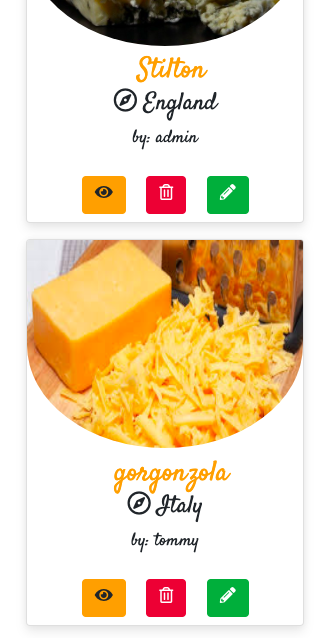

## Summary

* [Testing User Stories](#testing-user-stories)
* [Responsiveness](#responsiveness)
* [CRUD](#crud)
    * [Create](#create-pairing)
    * [Read](#read-pairing)
    * [Update](#update-pairing)
    * [Delete](#delete-pairing)

* [Overall](#overall)
    * [Navigation](#navigation)
    * [View Cheeses](#view-cheeses)
    * [Search Box](#search-box)
    * [Register](#register)
    * [Log In](#log-in)
    * [Profile](#profile)
    * [Add Pairing](#add-pairing)
    * [Edit Pairing](#edit-pairing)
    * [Footer](#footer)

#### Back to [Readme.md](https://github.com/sophieboyle1/milestone-3)

---

## Testing User Stories

### Guest User

* As a guest user, I want to browse and understand the concept of the website easily.
  * The main image includes a photo of cheese and wine, and title on the landing page states "Cheese & Wine" with a further about section below. 

* As a guest user, I want to be able to access this website from different devices easily.
  * Website has been tested and is responsive on iphone, tablet, labtop and desktop.
  * All elements are contained and the image is not distored.

* As a guest user, I want to easily navigate the site so that I can find content quickly and with ease.
  * The site has individual sections clearly seperated.
  * The main pages are located in the nav bar.

* As a guest user, I want to be able to contact the site owner with any further questions I may have.
  * Contact section has been provided on the landing page, with a contact modal. It gives the user feedback as to whether the email has been sent or if there is a error and to try again.

* As a guest user, I want to easily register to the site, so that I can add my own pairings.
  * There are two options to register to the site -
  * The first is on the landing page, there is a register button in the jumbotron section.
  * The second is directly in the nav bar.

* As a guest user, I want to be able to search through the cheeses to check if they have one I am interested in.
  * There is a search function in the "View Cheeses" page, where the user can search for a cheese by its Country of origin.

### Registered User

* As a registered user, I want to be able to log in with my username and password.
  * All login funconalitys are working with no erros, the data base saves the user's information for everytime he/she wishes to log in.

* As a registered user, I want to be able to create and add cheese and wine pairings to the website.
  * In the "Add Pairing" page, the user has the option to add their own pairing to the site, which will then show on their profile.

* As a registered user, I want the option to edit my pairings on the website
  * In the user's profile and in the "View Cheeses" page, the user has the ability to edit their pairing.

* As a registered user, I want the option to delete my pairing if I wish to.
  * As stated above, the user also has the option to delete their pairing if they wish to do so.

* As a registered user, I want to be able to delete my profile.
  * The user can delete their profile at any time, by clicking onto their profile page. Their pairings will also be deleted.

* As a registered user, I want the option to see all the published pairings on the site.
  *  Once a user has added a pairing to the site, it will then be published along with the rest of the pairings, for everybody to see.

### Admin
* As an admin, I want the ability to edit or delete all user pairings on the website and delete if necessary.
  * In the profile section, only admin of the site has the ability to edit or delete any of the user's pairings. 

---

## Responsiveness

This site was was tested on multiple browsers (Google Chrome, Mozzila Firefox and Opera), multiple mobile devices (Samsung Galaxy, Huawei, Sony) and tablet device(Samsung Galaxy Tab) and it shown responsivness and compatibility. Web-site is responsive for screens from 350px to 2k. Everything is in order and responsive.

| Functionality | Expected Outcome | Actual Outcome | Pass/Fail |
| :-------------: |:----------------:| :--------------: | :---------: |
| Viewing on mobile device | Images adapted, no overflow | As Expected | Pass |
| Viewing on tablet device | Cheese cards fixed to two per row | As expected | Pass |
| Viewing on laptop device | All in order, no distortion | As expected | Pass |
| Viewing on desktop device up to 2k | All in order, no distortion | As expected | Pass |

---

## CRUD

CRUD functionality is working as expected, no errors.

### Create Pairing

| Functionality | Expected Outcome | Actual Outcome | Pass/Fail |
| :-------------: |:----------------:| :--------------: | :---------: |
| Clicking on `Submit` button without filling all the forms | Displays Validation to tell the user to enter all the forms | As Expected | Pass |
| Clicking on `Submit` button after filling all the forms | Redirect to the "View Cheeses" page, added sucessfully in profile and view cheeses | As expected | Pass |

### Read Pairing

| Functionality | Expected Outcome | Actual Outcome | Pass/Fail |
| :-------------: |:----------------:| :--------------: | :---------: |
| Clicking on cheese cards | Displays pairing once clicked view on cheese card | As Expected | Pass |

### Update Pairing

| Functionality | Expected Outcome | Actual Outcome | Pass/Fail |
| :-------------: |:----------------:| :--------------: | :---------: |
| Clicking on `Edit` button | Directs the user to the edit pairing page, with previous information stored | As Expected | Pass |
| Clicking on `Cancel`| Cancel all changes and user is redirected to original pairing submisson | As Expected | Pass |
| Clicking on `Save` button without filling all the forms | Displays Validation to tell the user to enter all the forms | As Expected | Pass |
| Clicking `Save` button after changing some of the forms | Redirect to the view cheese page and the pairing is edited | As expected | Pass |

### Delete Pairing

| Functionality | Expected Outcome | Actual Outcome | Pass/Fail |
| :-------------: |:----------------:| :--------------: | :---------: |
| Clicking on `Delete` button | Display delete modal for confirmation | As Expected | Pass |
| Clicking on `Delete` button on modal | user's pairing is delete from site and data base | As Expected | Pass |

---

## Overall

### Navigation

| Functionality | Expected Outcome | Actual Outcome | Pass/Fail |
| :-------------: |:----------------:| :--------------: | :---------: |
| Clicking on Logo button | Opens "Index" page | As Expected | Pass |
| Clicking on `View Cheeses` link | Opens "All Cheeses" page | As expected | Pass |
| Clicking on `log In` link | Opens Log In page | As expected | Pass |
| Clicking on `Register` link | Opens Register page | As expected | Pass |
| Clicking on `Profile` link | Opens Profile page | As expected | Pass |
| Clicking on `log Out` link | Logs out user and redirects to log in page | As expected | Pass |

### View Cheeses

| Functionality | Expected Outcome | Actual Outcome | Pass/Fail |
| :-------------: |:----------------:| :--------------: | :---------: |
| Clicking on "View" button | Opens full pairing page | As Expected | Pass |
| Clicking on `Back to cheeses` button | Redirects the user to "All Cheeses" | As expected | Pass |

### Search Box

| Functionality | Expected Outcome | Actual Outcome | Pass/Fail |
| :-------------: |:----------------:| :--------------: | :---------: |
| Searching for a cheese by country | shows expected cheese from the country | As Expected | Pass |
| Searching for a cheese by country not in data base | shows no results found | As Expected | Pass |
| Clicking on "Reset" button | Refreshes the "All Cheese" page | As Expected | Pass |
| Clicking on "Search" button | shows appicable pairings | As Expected | Pass |

### Register

| Functionality | Expected Outcome | Actual Outcome | Pass/Fail |
| :-------------: |:----------------:| :--------------: | :---------: |
| Clicking on `Sign In` button without filling all the forms | Displays validation to tell the user to enter all the forms | As Expected | Pass |
| Entering a email address wihtout "@" | Displays validation to tell the user to enter a valid email address | As Expected | Pass |
| Entering a username that is already taken | shows username already exists | As Expected | Pass |

### Log In 

| Functionality | Expected Outcome | Actual Outcome | Pass/Fail |
| :-------------: |:----------------:| :--------------: | :---------: |
|  Clicking on `Log In` with correct username and password | Directs user to their profile page | As Expected | Pass |
|  Clicking on `Log In` with Incorrect username and password | flash message to user showing incorrect username or password | As Expected | Pass |

### Profile

| Functionality | Expected Outcome | Actual Outcome | Pass/Fail |
| :-------------: |:----------------:| :--------------: | :---------: |
| Shows username and location | The profile card sucessfully grabs the user's information from data base | As Expected | Pass |
| Clicking on `Delete Profile` button on profile page | user's profile is deleted from site and data base | As Expected | Pass |
| Clicking on `Create New` button on profile page | User is directed to the add pairing page | As Expected | Pass |
| Your cheese pairings section | user's profile shows his/her previously submitted pairings | As Expected | Pass |
| Clicking on `View` button on profile page | user is directed to view their pairing | As Expected | Pass |
| Clicking on `Edit` button on profile page | user is directed to edit their pairing | As Expected | Pass |
| Clicking on `Delete` button on profile page | user is directed to modal to delete their pairing | As Expected | Pass |

### Add Pairing

| Functionality | Expected Outcome | Actual Outcome | Pass/Fail |
| :-------------: |:----------------:| :--------------: | :---------: |
| Clicking on `Submit` button without filling all the forms | Displays Validation to tell the user to enter all the forms | As Expected | Pass |
| After clicking on `Submit` button | User is redirected to "All Cheeses" page, their pairing now sucessfully showing | As Expected | Pass |

### Edit Pairing

| Functionality | Expected Outcome | Actual Outcome | Pass/Fail |
| :-------------: |:----------------:| :--------------: | :---------: |
| Clicking on `Edit` button | User is redirected to "Edit your pairing" page | As Expected | Pass |
| Clicking on `Cancel` button | User is redirected main cheese page | As Expected | Pass |
| Clicking on `Save Changes` button | The users information is updated and user is redirected to their pairing | As Expected | Pass |

### Footer

| Functionality | Expected Outcome | Actual Outcome | Pass/Fail |
| :-------------: |:----------------:| :--------------: | :---------: |
| Clicking on `Facebook` icon | Opens Facebook website in new tab | As expected | Pass |
| Clicking on `Instagram` icon | Opens Instagram website in new tab | As expected | Pass |
| Clicking on `YouTube` icon | Opens YouTube website in new tab | As expected | Pass |
| Clicking on `Twitter` icon | Opens Twitter website in new tab | As expected | Pass |

[Back to top](#summary)

